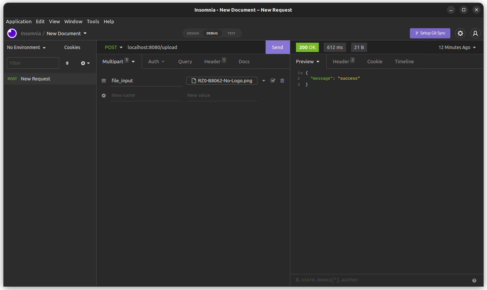

# Golang GCS

### How to run:
1. install package dependency
```go
go mod tidy
```
2. generate key `service-account.json` from your GCS project and put file path.
3. run project
```go
go run main.go
``` 
4. test upload with client test API application `insomnia` or `postman`
